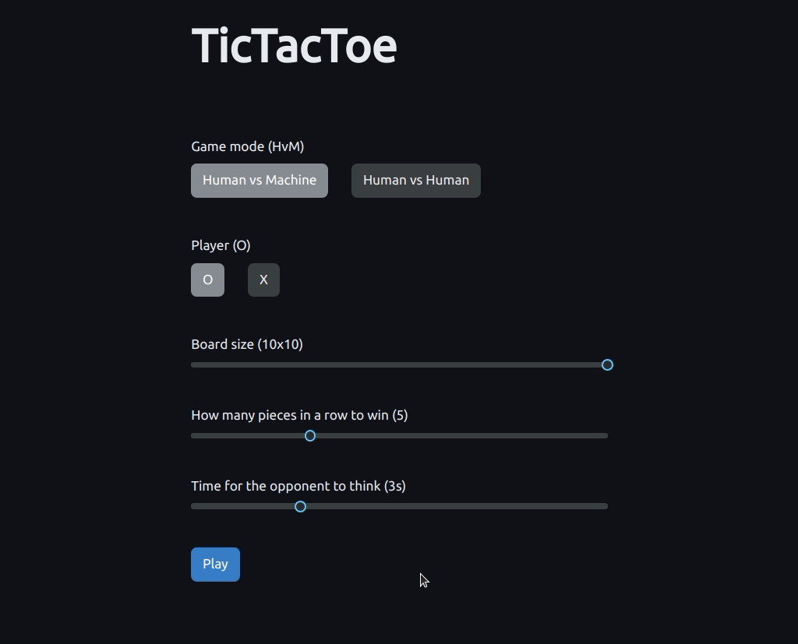

# TicTacToe

## User guide

This project was developed using JDK 15.0.1. To run it (among other ways) you can execute the `run` gradle task. This will open a server at [localhost:8080](http://localhost:8080).

## Design decisions

MVC is used as architectural pattern, where the model is implemented in the `commonMain` module (so that it can be shared by server and client), the view is implemented in the `jsMain` module and the controller is split through the three modules (`commonMain`, `jsMain` and `jvmMain`).

To obtain the machine's play, the client makes a request to the server and, for simplification, the client always sends the serialized game model in each of these requests, which means that we have a stateless server.

Throughout the development design patterns were used where needed. For example:

- **Strategy** pattern: for how to make a play, for example, in HvH or HvM modes - [code](project/src/jsMain/kotlin/controller/move)
- **State** pattern: for coordinating the states of the game (playing, pause, welcome screen, error, game over) - [code](project/src/jsMain/kotlin/controller/states)
- **Abstract factory** pattern: for generically instantiating a move strategy without knowing which of them it is - [code](project/src/jsMain/kotlin/controller/move/factory)
- **Factory method** pattern: for centralizing the instantiation of game states - [code](project/src/jsMain/kotlin/controller/GameStateFactory.kt)

## Machine plays

The machine plays are obtained by using a combination of Monte Carlo Tree Search (MCTS) and some manual checking (by searching for play patterns on the game board). The machine manually checks (only) for defensive plays and the output of this overrules the output of MCTS only if it proves more beneficial. Other approaches using MiniMax were tried but didn't achieve comparable results because of the high branching factor of this version of the game.

Implementation: [MCTSRobot](project/src/jvmMain/kotlin/ai/MCTSRobot.kt)
